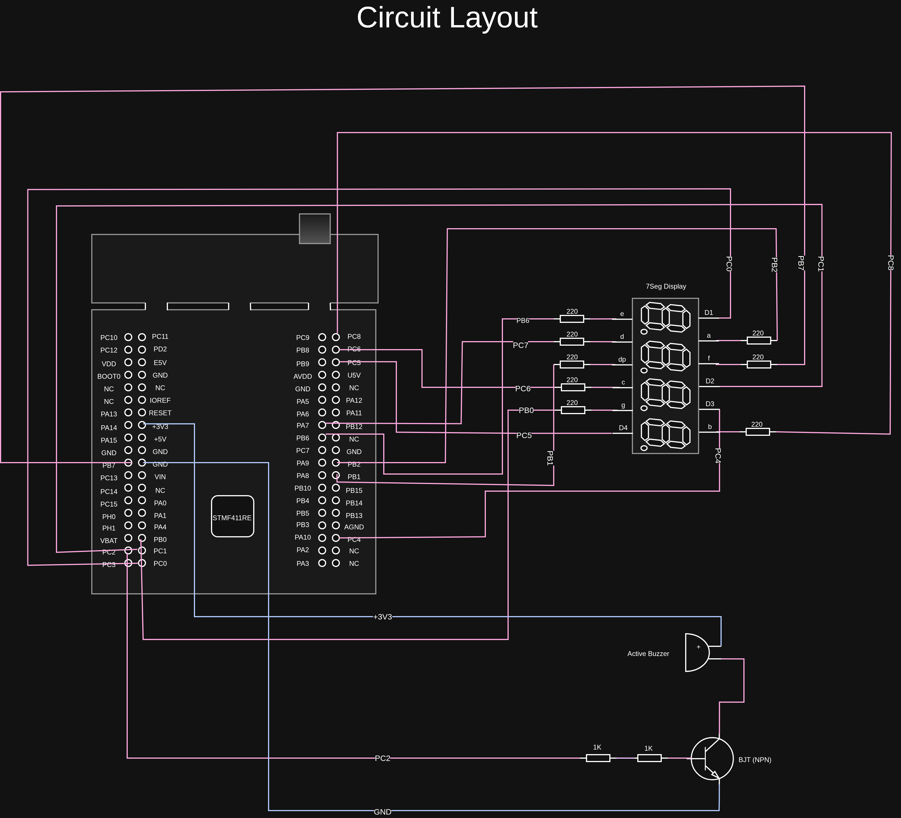

# **Simple Clock And Timer Device**

**DESC:** A simple and fast clock/timer device created on the STM32F411 microcontoller using bare metal programming techniques with no abstraction and external contoller devices.

**Accessories used:**

- Breadboard (1ea.)
- 220 OHMs resistor (8ea.)
- 1 kOHMs resistor (2ea.)
- Wires
- Active buzzer - TMB12A05 (1ea.)
- Transistor - NPN S8050 TO-92 (1ea.)
- 4 digit multiplexed 7 segment display - 3461BS-1 (1ea.)
- Nucleo-F411 development board (1ea.)

**Circuit Layout:**  

### **How To Run**:

**Prerequisites:** arm toolchain, openocd, make

**Loading The Program:**

1. Run `make all` to build the project.
2. Connect your development board to the computer and run `make load` to flash the program to the MCU

**Usage:**
- single tap the blue user button (PC13) on the NucleoF411 board to switch between clock and timer. "C" is displayed when swtiching to clock and "P" for timer.
- For setting the clock hold the blue user button for 5 second followed by 4 beeps. Set the minutes and hours (24 hour format) by single tapping the blue button; when done with minute or hour hold for 2 seconds followed by 2 beeps to either move to setting up the next digit or finishing the setup.
- To set the timer switch to timer and do the same proccess as for setting the clock, in this case for seconds and minutes.
- To pause timer, switch to timer mode and press the blue button for 2 seconds followed by 2 beeps.
- The timer will count even when displaying clock.
